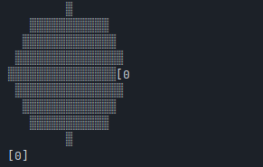

# Rotawheel Language Documentation
Docs for the Rotawheel (Patent Pending) spatial language. Rotawheel uses 2 "Wheels", which act like continuous stacks. Variables don't have a name, but rather a position, which can be rotated to on the VWheel (Variable Wheel) to use. Control flow also depends on this
## Core Concepts: Wheels

Rather than having a traditional variable and control flow structure, this Esolang uses two wheels:
- A Variable Wheel, which stores all the variables in a contiguous structure (a literal wheel in other words)
  - This wheel isn't accessed by names, but rather positions in the index 
- A Code Wheel, which stores the lines of code for control flow
  - JMP-based instructions step forward and backwards based on this
### VWheel (Variable Wheel)

A VWheel is a circular array that stores data, which can be integers or strings. Each VWheel has:
- A `cursor` that points to the current element in the wheel.
- A `direction` (1 for forward, -1 for backward) which determines how the cursor moves.
- A `CMPFLAG` (comparison flag), which is a boolean that stores the result of the last `CMP` operation.

The virtual machine maintains a stack of VWheels. The topmost VWheel is the one currently being operated on. When a function is called, a new VWheel is pushed onto the stack for its local scope. When the function returns, the wheel is popped.

### CWheel (Code Wheel)

The CWheel is a single, circular array that holds all the program's instructions. It has:
- A `cursor` that points to the instruction currently being executed.
- A `direction` (1 for forward, -1 for backward) which controls the flow of execution.

Normally, the CWheel cursor advances one step at a time. However, instructions like `JIZ` or function calls can move the cursor to a different location.

## Instruction Set

Here is a list of all the instructions available in Twist.

### Special Controls
**%** `implicit`
- The percent symbol, when used with a instruction that takes arguments, attempts to implicitly find the number of arguments needed
- eg :-
```
DEF "HI" 2
    OUT "HI"
CALL "HI" % ; will attempt to automatically push TWO arguments
```
### Execution and Flow Control

**DEL** `milliseconds`
- Delays program execution for the specified number of milliseconds.
- Example: `DEL 1000` (waits for 1 second)

**DEF** `function_name` `argument_count`
- Defines a function with a given name and the number of arguments it expects. The function's code block ends with a `RET` instruction.
- Example: `DEF my_func 2`

**CALL** `function_name` `[argument_count]`
- Calls a function. It can be called with an explicit number of arguments to be taken from the argument stack. 
- Example: `CALL my_func 2` or `CALL my_func %`

**RET**
- Returns from a function call. The value at the cursor of the current VWheel is passed as the return value to the caller's VWheel.

**JIZ** `steps`
- "Jump If Zero". If the `CMPFLAG` of the current VWheel is `false`, the CWheel's cursor is moved by the specified number of `steps`. 
- Note: negative steps means forward, positive means backward
- Example: `JIZ 5`

**JMP** `steps`
- JIZ, but without any of the IZ. Jumps always, regardless of the current CMPFLAG state.
- The same behaviour can be achieved through `JIZ "THIS STRING WILL NEVER APPEAR BEBEBEBEEBEB" 5`
**WHLDIRV** `direction`
- Sets the direction of the current VWheel. `1` for forward, `-1` for backward.
- Example: `WHLDIRV -1`

**WHLDIRC** `direction`
- Sets the direction of the CWheel. `1` for forward, `-1` for backward.
- Example: `WHLDIRC -1`

### Data Manipulation

**NEWV** `value`
- Pushes a new value (integer or string) onto the current VWheel.
- Example: `NEWV 10` or `NEWV "hello"`

**MOVVW** `steps`
- Moves the cursor of the current VWheel by the specified number of `steps` in its current direction.
- Example: `MOVVW 2`

**ADDARG**
- Adds the value at the current VWheel cursor to the global argument stack.

### Arithmetic Operations

For `ADD`, `SUB`, `MUL`, and `DIV`:
- If called with an integer argument, the operation is performed between the argument and the value at the VWheel cursor.
- If called with the `%` (args) flag, it pops the specified number of arguments from the argument stack and performs the operation.
- If called with no argument, it performs the operation on all numeric values in the current VWheel.

**ADD** `[value | %]`
- Performs addition.

**SUB** `[value | %]`
- Performs subtraction.

**MUL** `[value | %]`
- Performs multiplication.

**DIV** `[value | %]`
- Performs division.

### Comparison

**CMP** `[value | %]`
- Compares the value at the VWheel cursor with a given value or a value from the argument stack.
- If the values are integers, it checks if the cursor's value is greater.
- If the values are strings, it checks for equality.
- The result is stored in the VWheel's `CMPFLAG`.
- Example: `CMP 10` or `CMP "test"` or `CMP %`

### Input/Output

**OUT** `[string]`
- If a string argument is provided, it prints the string.
- Otherwise, it prints the value at the current VWheel cursor.
- Example: `OUT "Result:"` or `OUT`

**INP** `[prompt_string]`
- Prompts the user for input and stores the result at the current VWheel cursor. Storage depends if the input is a valid integer
- To prompt a string, enter an optional prompt string. To display without, just use INP
- Example: `INP "Enter a number:"`

### Debugging

**DBGPRINTV**

- Prints a visual representation of the current VWheel, showing its data, cursor position, and structure.
- Example (The wheel is shaded differently depending on the number of variables:
-  

**DBGPRINTC**
- Prints a visual representation of the CWheel, showing all instructions and the current execution cursor.

**ARGVIEW**
- Prints the contents of the current argument stack.

### Error Handling

**ERRH** `[error]` `[steps]`
- Takes one argument as the error, or none to handle all
- Upon the error being triggered, performs the same function as JMP <br>
Table: 
```plan9_x86
    BAD_ARGUMENT_ERROR          = "Bad Argument"
	INCORRECT_TERMINATION_ERROR = "Incorrect Termination"
	EMPTY_VWHEEL_ERROR          = "Cannot move on empty VWheel"
	NUMERIC_DATA_ERROR          = "Numeric data required in VWheel"
	NOT_ENOUGH_ARGS_ERROR       = "Not enough arguments"
	DIVISION_BY_ZERO_ERROR      = "Division by zero"
	UNDEFINED_FUNCTION_ERROR    = "Call to undefined function"
	ARITHMETIC_ERROR            = "Arithmetic error"
```
````
ERRH "BAD_ARGUMENT_ERROR" -5 ;will jump 5 ahead when faced with this error
````

### Examples:
- programs/calculator.whl
  - A basic calculator which takes two numbers and an operation
- programs/basic_for.whl
  - A basic implementation of a ```for``` loop using instructions
- programs/dbgprinttest.whl
  - demonstrates the working of ```DBGPRINTV``` 
- programs/base_comparison.whl
  - compares two numbers and says whihc one is greater
- programs/advanced_for.whl
  - a more fleshed out version that provides a usable function
